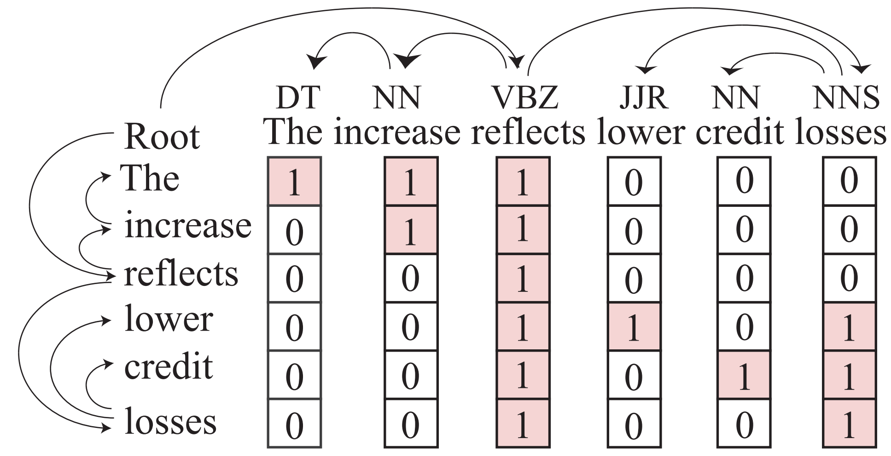

# SG-Net: Syntax-Guided Machine Reading Comprehension

 Codes for the AAAI 2020 paper **SG-Net: Syntax-Guided Machine Reading Comprehension**




## Installation
pip install -r requirements.txt

## Instructions
You can run the model with the script *run_squad.sh* and *run_race.sh*.

We upload the processed example data in *data* folder which is annotated by our dependency labeler for quick practice. 

The labeler model is the [HPSG-Neural-Parser](https://github.com/DoodleJZ/HPSG-Neural-Parser). The implementation for this work will be publicly available soon. 

### Reference

Please kindly cite this paper in your publications if it helps your research:

```
@inproceedings{zhang2019sgnet,
    title={{SG-Net}: Syntax-Guided Machine Reading Comprehension},
    author={Zhang, Zhuosheng and Wu, Yuwei and Zhou, Junru and Duan, Sufeng and Zhao, Hai and Wang, Rui},
    booktitle={Proceedings of the Thirty-Fourth AAAI Conference on Artificial Intelligence},
    year={2020}
}
```

:)


# Analysis of the code:

Goal of this project was to run this code, learn how the model works, understand the code and regenerate the results. Regenerating the result had some issues. As they are using a pretrained transformer with almost 100 million parameters, this project is very GPU intense. When the application was run with given parameters by the authors, (batch size = 8, evaluation batch size = 20 and a maximum sequence length of 384, the program gets a gpu error that it doesnot have enough memory.

Then lowering the batch size to 1 didn't help. Finally after reducing the max_seq_len to 32 and clearing the GPU cache after progression of each batch, the code ran.

As the SQuAD is a question answering dataset, for each question there are context paragraph of size more than 32. But because of gpu constrains we can't use the maximum sequence length and the model does not have enough information to understand the text. As a result the accuracy that we got from running the model was not as high as the paper mentioned. 

N.B. My goal to learn Pytorch, implementing models write code more fluently was acheived learing this code. Using the basic idea from this project, I did some other NLP tasks like Sentence Translation, Sentiment analysis ect.

